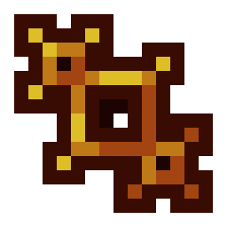

New Generation - контент-пак для [VoxelCore](https://github.com/MihailRis/voxelcore) (находится в beta-версии)

В этом контент-паке есть базовые механики выживания, свой генератор мира, множество блоков и предметов.

Наиболее стабильная версия контент-пака находится в ветке main. На версиях VoxelCore до 0.31.2 может работать некорректно

Аддон для New Generation: [Project L.A.R.I.X.](https://github.com/EsPaKira/Project-L.A.R.I.X.)

Чтобы поменять режим игры с креатива на выживание, напишите в чате /gamemode survival. В противоположном случае напишите /gamemode creative

*New Generation использует участки кода, находящиеся под лицензией MIT других разработчиков*
