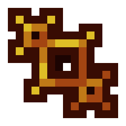

New Generation - контент-пак для [VoxelCore](https://github.com/MihailRis/voxelcore) (находится в beta-версии)

[Подробнее про NewGen](https://github.com/EsPaKira/New-Generation/blob/main/doc/about.md)

[Скачать последнюю версию](https://github.com/EsPaKira/New-Generation/releases/latest)

[Документация для 0.6](https://github.com/EsPaKira/New-Generation/blob/0.6.0-dev/doc/main_page.md)

Переносится под мультиплеер (бОльшая часть контента **временно** вырезана).

Наиболее стабильная версия контент-пака находится в ветке main. Multiplayer-версия может работать некорректно на версиях VoxelCore до 0.32.

Аддон для New Generation: [Project L.A.R.I.X.](https://github.com/EsPaKira/Project-L.A.R.I.X.)

**Обязательно** используйте [Neutron](https://github.com/Xertis/Neutron-Server), Neutron Client и Quartz вместе с *этой* версией NewGen.

Чтобы поменять режим игры с креатива на выживание, напишите в чате /gamemode survival. В противоположном случае напишите /gamemode creative.